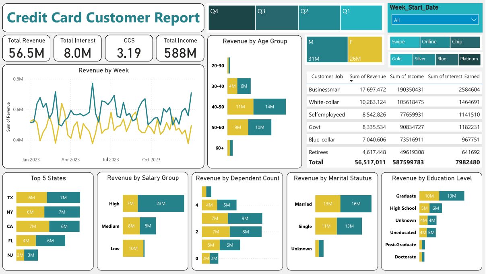
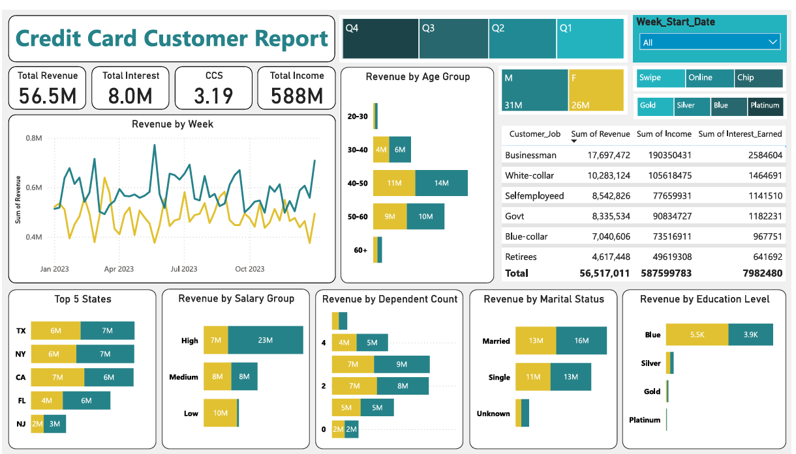

# 💳 Credit Card Financial Analysis — SQL & Power BI

A complete **Credit Card Financial Analysis** project built using **MySQL** and **Microsoft Power BI**, analyzing **credit card and customer records** loaded from 4 CSV files. The project delivers a **2-page interactive dashboard** covering revenue trends, transaction behavior, customer demographics, and credit risk indicators — enabling data-driven decisions in the BFSI sector.

---

## 📌 Project Objectives
- Analyze credit card revenue across card categories, expenditure types, and customer segments.
- Track transaction trends across quarters and payment methods.
- Identify high-value customer segments by job, income, and education.
- Detect credit risk through delinquent account monitoring.
- Provide actionable insights to optimize marketing and financial strategies.

---

## 🗂 Dataset Information
- **Records**: 10,293 credit card + customer records (combined from 4 CSV files)
- **Tables**: 2 — `credit_card_details` and `customer_details`
- **Key Features**: Card category, transaction amount, interest earned, expenditure type, payment method, customer job, income, education level, marital status, state, satisfaction score, delinquency flag.

---

## 🛠️ Tools & Technologies

### **Database & Setup**
- MySQL — Database creation, table schema design, LOAD DATA INFILE

### **Visualization**
- Power BI — KPI Cards, Line chart, Bar charts, Matrix table, DAX measures, Interactive slicers

---

## 📂 Project Files
| File | Description |
|------|-------------|
| `Credit_Card_Analysis.sql` | Database setup & data loading queries |
| `Credit_Card_financial_Analysis.pbix` | Power BI dashboard file |
| `Credit_Card_Customer_Dashboard.pdf` | Customer report preview |
| `Credit_Card_Transaction_Dashboard.pdf` | Transaction report preview |
| `credit_card.csv` | Credit card transaction data |
| `cc_add.csv` | Additional credit card records |
| `customer.csv` | Customer demographic data |
| `cust_add.csv` | Additional customer records |

---

## ⚙️ Steps Performed

### **1️⃣ SQL — Database Setup & Data Loading**
- Created relational database with 2 tables
- Loaded 4 CSV files using LOAD DATA INFILE
- Handled date formatting and data type mapping

### **2️⃣ Power BI — Dashboard Development**
- Connected Power BI to MySQL database
- Built Page 1: Credit Card Transaction Report
- Built Page 2: Credit Card Customer Report
- Created KPI cards, charts, matrix tables and slicers
- Wrote DAX measures for revenue and interest calculations

---

## 📊 Dashboard Overview

### Page 1 — Credit Card Transaction Report

- **KPIs**: Total Revenue, Total Interest, Transaction Count, Transaction Amount
- **Visuals**: QTR Revenue & Transaction Count (combo chart), Revenue by Card Category (matrix), Revenue by Expenditure Type, Revenue by Education, Revenue by Customer Job, Revenue by Use Chip, Customer by Card
- **Filters**: Quarter, Income Group, Gender, Card Category, Week Start Date

### Page 2 — Credit Card Customer Report

- **KPIs**: Total Revenue, Total Interest, Customer Satisfaction Score, Total Income
- **Visuals**: Revenue by Week (line), Revenue by Age Group, Revenue by Job, Revenue by Salary Group, Revenue by Marital Status, Revenue by Education, Top 5 States, Revenue by Dependent Count
- **Filters**: Quarter, Gender, Card Category, Week Start Date

---

## 🔍 Key Insights
- 💰 **Total Revenue: $45.5M** | **Total Interest Earned: $7.98M** | **667K transactions**
- 📋 **Bills** was the #1 expenditure type at **$11.1M** — higher than Entertainment and Fuel combined
- 👔 **Business professionals** generated the highest revenue at **$14.5M** — nearly 2x White-collar workers ($8.4M)
- 💳 **Blue card** holders dominated with **$37.8M** — 83% of total card revenue
- 📱 **Swipe transactions** accounted for **$28.5M** vs only **$2.8M** online — showing significantly lower digital adoption
- 💵 **High income customers** contributed **$24.6M** vs **$8M** from Low income — a 3x difference
- 📅 **Q4** was the strongest quarter at **$11.7M** — indicating a year-end spending spike
- ⚠️ **624 delinquent accounts** identified — a key credit risk flag requiring immediate attention
- 📍 **Texas and New York** were the top revenue states at ~$10.5M each
- 📊 **Average credit utilization ratio: 27.45%**

---

## ✅ Business Value
This dashboard helps:
- 🎯 **Marketing Teams** — Target high-income segment for premium card upgrades
- 💳 **Product Teams** — Push digital payment adoption — online usage is significantly low
- ⚠️ **Risk Teams** — Monitor delinquent accounts proactively to reduce credit exposure
- 📅 **Sales Teams** — Capitalize on Q4 spending spike with targeted campaigns
- 🏦 **Executives** — Make informed decisions on card category strategy and geographic expansion

---

## 👨‍💻 Author
**Rohit Wagh**  
- 📧 Email: rohitwagh6264@gmail.com  
- 🔗 LinkedIn: https://linkedin.com/in/rohit-wagh6264/  
